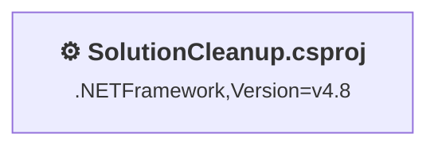
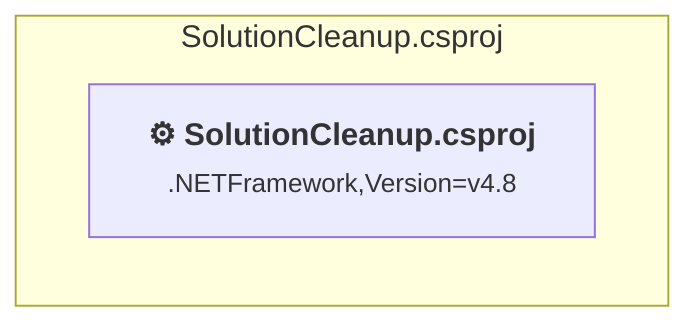

# Projects and dependencies analysis

This document provides a comprehensive overview of the projects and their dependencies in the context of upgrading to .NET 9.0.

## Table of Contents

- [Projects Relationship Graph](#projects-relationship-graph)
- [Project Details](#project-details)

  - [SolutionCleanup\SolutionCleanup.csproj](#solutioncleanupsolutioncleanupcsproj)
- [Aggregate NuGet packages details](#aggregate-nuget-packages-details)

## Projects Relationship Graph

Legend:
📦 SDK-style project
⚙️ Classic project

## Project Details

### SolutionCleanup\SolutionCleanup.csproj

#### Project Info

- **Current Target Framework:** .NETFramework,Version=v4.8
- **Proposed Target Framework:** net10.0
- **SDK-style**: False
- **Project Kind:** ClassicClassLibrary
- **Dependencies**: 0
- **Dependants**: 0
- **Number of Files**: 10
- **Lines of Code**: 514

#### Dependency Graph

Legend:
📦 SDK-style project
⚙️ Classic project

#### Project Package References

| Package | Type | Current Version | Suggested Version | Description |
| :--- | :---: | :---: | :---: | :--- |
| Community.VisualStudio.Toolkit.17 | Explicit | 17.0.533 |  | ⚠️NuGet package is incompatible |
| Community.VisualStudio.VSCT | Explicit | 16.0.29.6 |  | ⚠️NuGet package is incompatible |
| MessagePack | Explicit | 3.1.4 |  | ✅Compatible |
| Microsoft.VSSDK.BuildTools | Explicit | 17.14.2101 | 15.7.104 | ⚠️NuGet package is incompatible |

## Aggregate NuGet packages details

| Package | Current Version | Suggested Version | Projects | Description |
| :--- | :---: | :---: | :--- | :--- |
| Community.VisualStudio.Toolkit.17 | 17.0.533 |  | [SolutionCleanup.csproj](#solutioncleanupcsproj) | ⚠️NuGet package is incompatible |
| Community.VisualStudio.VSCT | 16.0.29.6 |  | [SolutionCleanup.csproj](#solutioncleanupcsproj) | ⚠️NuGet package is incompatible |
| MessagePack | 3.1.4 |  | [SolutionCleanup.csproj](#solutioncleanupcsproj) | ✅Compatible |
| Microsoft.VSSDK.BuildTools | 17.14.2101 | 15.7.104 | [SolutionCleanup.csproj](#solutioncleanupcsproj) | ⚠️NuGet package is incompatible |

