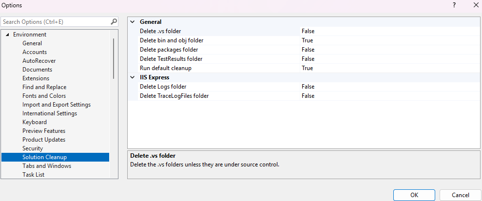
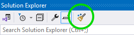
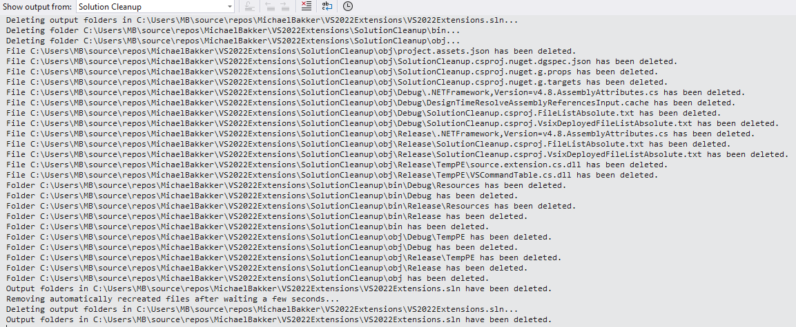

# Solution Cleanup

### Features
- Clean Bin / Obj folders (including automatically regenerated files)
- Clean .vs folder
- Clean TestResults folder
- Clean packages folders
- Clean IIS Express Logs
- Clean IIS Express TraceFiles

Files will be deleted only if they are not under source control.  
Folders will be deleted only if they are empty after cleanup.

Configure Solution Cleanup through Tools -> Options -> Solution Cleanup  

### Get started

To avoid adding yet another illogically ordered menu entry to the solution context menu in Solution Explorer, a button is added to the toolbar of Solution Explorer.  

Click it to start a Solution cleanup.
Progress will be displayed in the Output window, which is automatically activated.  

If you run into any issues: click [here](https://github.com/TheBlueHeron/VS2022Extensions/issues).  
If you have any feature requests, click [here](https://github.com/TheBlueHeron/VS2022Extensions/discussions/1).